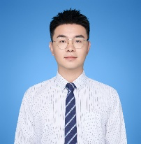

# Xi Zhao

**AI Solutions Architect · Physics PhD**

I build AI systems for industry and science.

Currently at Inspur Group, working on enterprise agents, research automation, and quantum computing.

[Email](mailto:zx4612@mail.ustc.edu.cn) · [Work](#selected-work) · [Experience](#experience) · [Research](#research)

 

## Selected work

### [OpenQuantum](https://github.com/xi-zhao/OpenQuantum)

*Quantum computing × AI agents*

An open-source quantum agent platform built on DeepSeek Harness. It brings quantum applications, algorithms, hardware, and messaging interfaces into one working environment.

Open source · Featured by awesome-dsh-plugin and dsh.io

### [RunThePaper](https://github.com/xi-zhao/RunThePaper)

*Scientific research automation*

An agent that moves beyond reading papers to reproducing them—from equations and code to numerical results and iteration after failure.

100+ papers reproduced autonomously

### [Fluxq](https://github.com/xi-zhao/fluxq-valid308-evidence)

*Quantum code generation*

An LLM harness that turns code generation into a repair loop, combining structural checks, normalization, and targeted correction.

Evaluated on 308 public quantum benchmarks

## Experience

### Inspur Group

**AI Solutions Architect & Postdoctoral Researcher** · 2024 — Present

I lead AI projects from the first conversation to the working system—product definition, architecture, infrastructure, and delivery.

- **Yuanxiaozhi Agent Cloud** — Led the move from an internal chatbot to an agent platform, covering data ingestion, structured extraction, generation, and enterprise applications.
- **HumagWork** — Designed a local human–agent workspace for organizational information, management summaries, and cross-team alignment.
- **SAIC Volkswagen FDE** — Worked with the intelligent-driving test team on data cleaning, test-case generation, vehicle-test automation, and AI training.
- **Quantum Radar** — Built a quantum-industry intelligence agent for information collection, classification, structured knowledge, and trend analysis.

### Beijing Academy of Quantum Information Sciences

**2023 — 2025** · Neutral-atom algorithms and quantum compilation

### Yangtze Delta Region Institute of UESTC

**2022 — 2023** · Quantum algorithms, chip EDA, and scientific computing

## Research

PhD in Physics from the University of Science and Technology of China, advised by Professor Wei Yi.

### Education

- **PhD in Physics** · University of Science and Technology of China · 2018 — 2024
- **BSc in Physics** · Zhoukou Normal University · 2014 — 2018

### Publications & research

- **Stable molecular state in a dissipative spin-orbit coupling Fermi gas** Physical Review A 108, 013311
- **Borromean state under an imaginary magnetic field** Chinese Physics B 34(3), 033101 · 2025
- **ZAP: A Zoned Architecture and Parallelizable Compiler for FPQA** IEEE Transactions on Quantum Engineering · 2026
- **MAS-Flag: An Auditable Role-Structured Controller for Fixed Budget Compiler Flag Search** Research work

### Selected patents

- Neutral-atom quantum circuit compilation method and system
- Full quantum compilation scheme for neutral-atom quantum computing systems
- Fast compilation scheme for zoned neutral-atom quantum computing architectures

## Contact

Have something interesting in mind? Let's talk.

[zx4612@mail.ustc.edu.cn](mailto:zx4612@mail.ustc.edu.cn) · Beijing, China
